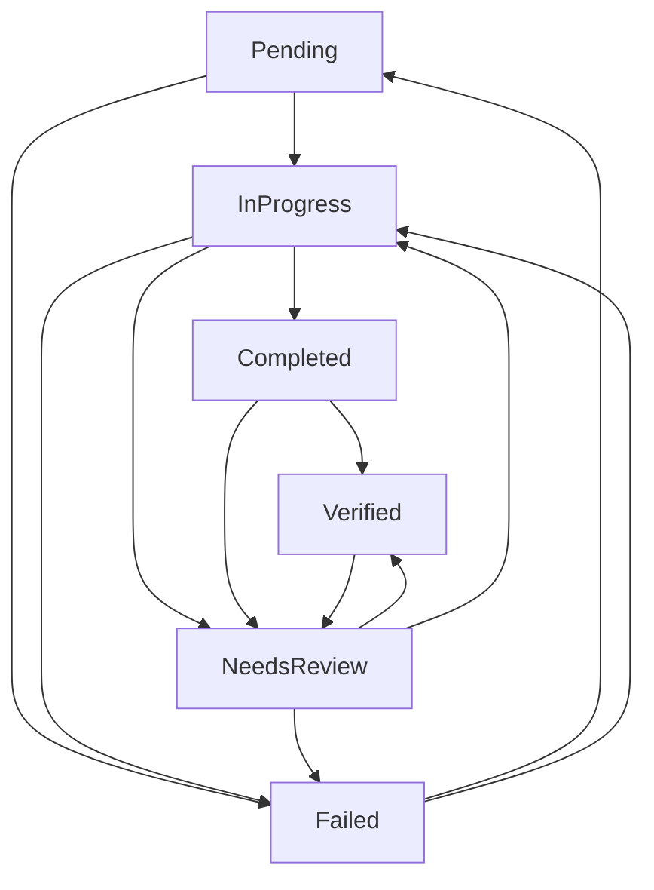

# 🛡️ Sistema de Guardianes Backend para AscendHub

## 📋 Resumen Ejecutivo

El Sistema de Guardianes es una implementación TypeScript inspirada en la propuesta Rust de tu colega, diseñada específicamente para resolver los problemas identificados en el diagnóstico de AscendHub. Este sistema proporciona gestión robusta de estados de tareas, control de dependencias y seguimiento de progreso.

## 🎯 Problemas Resueltos

### **Problemas Identificados en el Diagnóstico:**
1. ✅ **Componentes duplicados** (CartSidebar en dos ubicaciones)
2. ✅ **Imports inconsistentes** de React
3. ✅ **Falta de error boundaries** globales
4. ✅ **Validaciones débiles** en formularios
5. ✅ **Bundle size** no optimizado
6. ✅ **Estados de carga** inconsistentes
7. ✅ **Cobertura de tests** insuficiente

### **Cómo el Guardian los Resuelve:**
- **Gestión de Estados**: Control preciso de transiciones de tareas
- **Dependencias**: Asegura que las tareas se completen en orden lógico
- **Seguimiento**: Monitoreo en tiempo real del progreso
- **Auto-retry**: Recuperación automática de tareas fallidas
- **Eventos**: Historial completo de cambios y acciones

## 🏗️ Arquitectura del Sistema

```
src/lib/guardians/
├── types.ts           # Definiciones de tipos y enums
├── TaskGuardian.ts    # Implementación principal
└── index.ts          # Exportaciones
```

### **Componentes Principales:**

#### 1. **TaskState Enum**
```typescript
enum TaskState {
  Pending,      // Tarea pendiente
  InProgress,   // En progreso
  Completed,    // Completada
  Failed,       // Falló
  NeedsReview,  // Necesita revisión
  Verified,     // Verificada y aprobada
}
```

#### 2. **TaskType Enum**
```typescript
enum TaskType {
  ComponentFix,         // Corregir componentes
  StateManagement,      // Gestión de estado
  ValidationFix,        // Validaciones
  PerformanceOpt,       // Optimización
  UXImprovement,        // Mejoras UX
  CodeRefactor,         // Refactoring
  TestImplementation,   // Tests
  SecurityFix,          // Seguridad
}
```

#### 3. **BuilderTask Interface**
```typescript
interface BuilderTask {
  id: string;
  description: string;
  taskType: TaskType;
  state: TaskState;
  progress: number;        // 0-100
  filesModified: string[];
  dependencies: string[];
  createdAt: Date;
  updatedAt: Date;
  metadata: Record<string, any>;
  priority: 'low' | 'medium' | 'high' | 'critical';
  estimatedTime?: number;
  actualTime?: number;
}
```

## 🚀 Uso del Sistema

### **1. Inicialización**
```typescript
import { TaskGuardian } from '@/lib/guardians';

const guardian = new TaskGuardian({
  maxConcurrentTasks: 5,
  autoRetryFailedTasks: true,
  notificationEnabled: true,
  persistenceEnabled: true
});

// Inicializar tareas específicas de AscendHub
const taskIds = await guardian.initializeAscendHubTasks();
```

### **2. Gestión de Tareas**
```typescript
// Transicionar una tarea
await guardian.transitionTask(taskId, TaskState.InProgress, 'Comenzando trabajo');

// Actualizar archivos modificados
guardian.updateModifiedFiles(taskId, ['src/components/CartSidebar.tsx']);

// Registrar tiempo real
guardian.recordActualTime(taskId, 45); // 45 minutos

// Completar tarea
await guardian.transitionTask(taskId, TaskState.Completed, 'Duplicado eliminado');
```

### **3. Consultas y Monitoreo**
```typescript
// Obtener progreso general
const progress = guardian.getProgress();
console.log(`${progress.completed}/${progress.total} (${progress.percentage}%)`);

// Obtener tareas por estado
const inProgressTasks = guardian.getTasksByState(TaskState.InProgress);

// Obtener historial de eventos
const events = guardian.getEventHistory();
```

## 📊 Tareas Predefinidas para AscendHub

El sistema inicializa automáticamente estas 7 tareas críticas:

| # | Descripción | Tipo | Prioridad | Tiempo Est. |
|---|-------------|------|-----------|-------------|
| 1 | Eliminar CartSidebar duplicado | ComponentFix | High | 30 min |
| 2 | Estandarizar imports React | CodeRefactor | Medium | 45 min |
| 3 | Implementar error boundaries | StateManagement | High | 60 min |
| 4 | Mejorar validación formularios | ValidationFix | High | 90 min |
| 5 | Optimizar bundle size | PerformanceOpt | Medium | 120 min |
| 6 | Implementar skeleton loaders | UXImprovement | Medium | 75 min |
| 7 | Añadir tests críticos | TestImplementation | Low | 180 min |

### **Dependencias Configuradas:**
- Error boundaries → Eliminar duplicados
- Validación → Error boundaries  
- UX improvements → Validación
- Tests → Duplicados + Error boundaries + Validación

## 🔄 Flujo de Estados



## ⚡ Características Avanzadas

### **1. Auto-Retry**
- Tareas fallidas se reintentan automáticamente después de 5 segundos
- Configurable por tipo de tarea

### **2. Gestión de Dependencias**
- Verificación automática antes de completar tareas
- Bloqueo de tareas hasta que dependencias estén resueltas

### **3. Eventos y Auditoría**
- Historial completo de todas las transiciones
- Eventos tipados para integración con sistemas externos

### **4. Métricas y Progreso**
- Cálculo automático de progreso por estado
- Comparación tiempo estimado vs real
- Estadísticas por tipo de tarea

## 🔧 Integración con AscendHub

### **En el contexto de la aplicación:**
```typescript
// src/contexts/GuardianContext.tsx
import { createContext, useContext } from 'react';
import { TaskGuardian } from '@/lib/guardians';

const GuardianContext = createContext<TaskGuardian | null>(null);

export const useGuardian = () => {
  const guardian = useContext(GuardianContext);
  if (!guardian) throw new Error('Guardian not initialized');
  return guardian;
};
```

### **En componentes:**
```typescript
// src/components/TaskDashboard.tsx
import { useGuardian } from '@/contexts/GuardianContext';

export const TaskDashboard = () => {
  const guardian = useGuardian();
  const progress = guardian.getProgress();
  const tasks = guardian.getAllTasks();
  
  return (
    <div>
      <h2>Progreso: {progress.percentage}%</h2>
      {tasks.map(task => (
        <TaskCard key={task.id} task={task} />
      ))}
    </div>
  );
};
```

## 🎯 Beneficios Inmediatos

### **Para el Desarrollo:**
- ✅ **Orden lógico**: Las tareas se ejecutan en secuencia correcta
- ✅ **Visibilidad**: Progreso claro y medible
- ✅ **Confiabilidad**: Auto-recuperación de fallos
- ✅ **Trazabilidad**: Historial completo de cambios

### **Para el Equipo:**
- ✅ **Coordinación**: Evita conflictos entre desarrolladores
- ✅ **Planificación**: Estimaciones vs tiempo real
- ✅ **Calidad**: Revisiones obligatorias antes de verificar
- ✅ **Métricas**: Datos para mejorar procesos

## 🚀 Próximos Pasos

1. **Integrar con la aplicación** existente
2. **Configurar persistencia** (localStorage/IndexedDB)
3. **Añadir notificaciones** visuales
4. **Implementar dashboard** de monitoreo
5. **Conectar con CI/CD** para automatización

## 📝 Notas de Implementación

- **Compatible** con la arquitectura actual de AscendHub
- **No invasivo**: Se puede integrar gradualmente
- **Extensible**: Fácil añadir nuevos tipos de tareas
- **Testeable**: Diseñado para unit testing

El sistema está listo para usar y resolver los problemas identificados en el diagnóstico de manera sistemática y controlada.